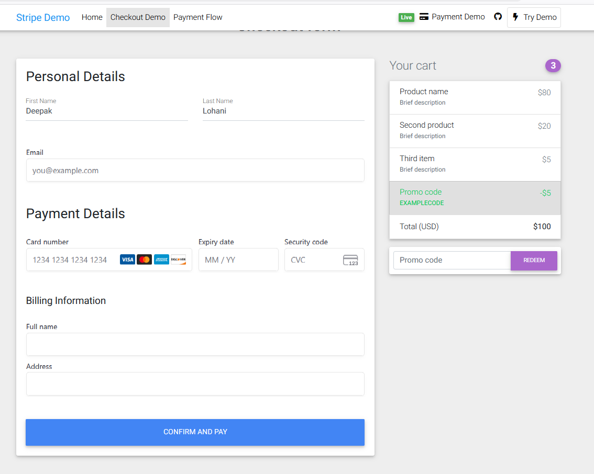
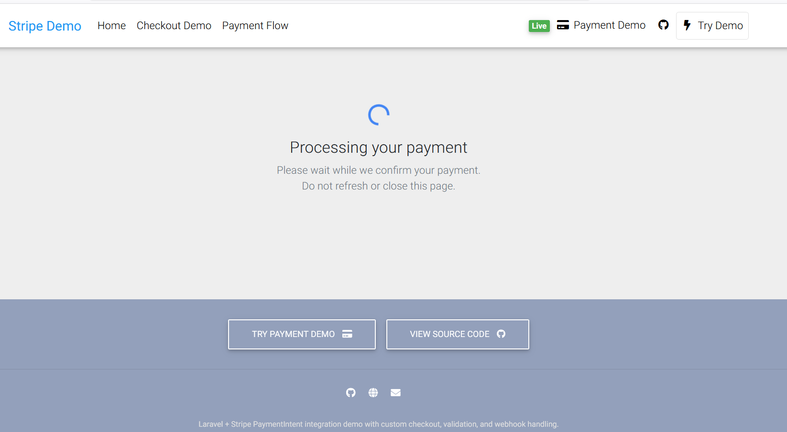
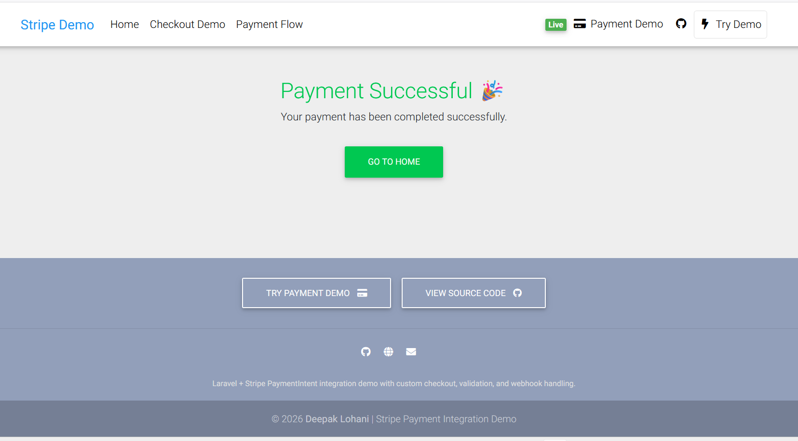
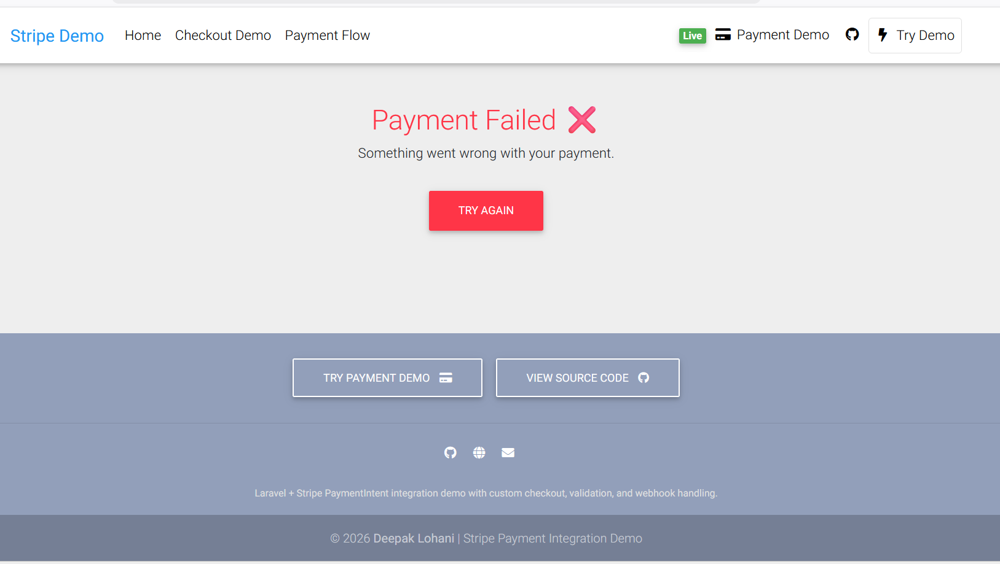

# 💳 Laravel Stripe PaymentIntent Checkout (Production Ready)

A complete real-world Stripe payment integration built with Laravel.

This project demonstrates a **production-level payment flow** using Stripe PaymentIntent, Stripe Elements, and Webhooks with proper validation and error handling.

---

## 🌐 Live Demo

🚧 Live demo coming soon

👉 You can run the project locally using the steps below

---

## 👤 Who Is This For?

This project is useful for:

* Businesses wanting to accept online payments
* Developers learning Stripe integration
* Startups building custom checkout systems
* Anyone needing secure payment processing

---

## 🚀 Features

* Stripe PaymentIntent integration
* Stripe Elements (Card, Email, Billing Address)
* Custom checkout (no Stripe hosted page)
* Frontend + Backend validation
* Webhook handling (success, failure, updates)
* Secure payment flow
* Clean architecture

---

## 🎯 Why This Project?

This project shows how to build a **real-world Stripe integration** with:

* Full control over UI/UX
* Secure backend validation
* Webhook-based payment confirmation
* Production-level structure

---

## 🧠 Key Concepts Used

- PaymentIntent lifecycle  
- Secure webhook signature validation  
- Backend payment confirmation (not frontend)  
- Error handling for failed payments  
- Clean separation of frontend and backend logic  

---

## 📦 What You Need Before Starting

Make sure you have:

* PHP (>= 8.1)
* Composer
* MySQL
* Git
* Stripe Account (Free)

---

## ⚙️ Installation 

👉 Make sure Composer is installed globally on your system

### Step 1: Clone Repo

```bash
git clone https://github.com/deepak18121988/laravel-stripe-payment-intent-checkout-webhook
cd laravel-stripe-payment-intent-checkout-webhook
```

---

### Step 2: Install Dependencies

```bash
composer install
```

---

## ⚙️ Step 3: Setup Environment File

You need to create a `.env` file from the example file.

👉 This file stores your project configuration (important)

### Option 1 (Command)

```bash
cp .env.example .env
```

### Option 2 (Manual - Beginner Friendly)

1. Find `.env.example` file
2. Copy it
3. Paste in same folder
4. Rename to:

```
.env
```

---

## 🔑 Step 4: 💳 Add Stripe Keys (IMPORTANT)

### 👉 How to get Stripe Keys:

1. Go to: https://dashboard.stripe.com/register
2. Login to your Stripe account
3. Click on **Developers → API Keys**

You will see:

* Publishable Key
* Secret Key

👉 Make sure you are using TEST mode keys (not live keys)

---

### 👉 Add keys in `.env` file:

```
STRIPE_KEY=your_publishable_key_here
STRIPE_SECRET=your_secret_key_here
STRIPE_WEBHOOK_SECRET=
```

---

## 🔐 Step 5: Setup Webhook (VERY IMPORTANT)

### Run this command:

```bash
stripe listen --forward-to localhost:8000/api/psp/webhooks/stripe
```

⚠️ Keep this terminal running while testing payments

👉 After running, you will get something like:

```
whsec_123456789
```

---

### 👉 Copy and paste into `.env`:

```
STRIPE_WEBHOOK_SECRET=whsec_123456789
```

---

## 🗄 Step 6: Setup Database

Update `.env`:

```
APP_URL=http://localhost:8000

DB_CONNECTION=mysql
DB_HOST=127.0.0.1
DB_PORT=3306
DB_DATABASE=your_database_name
DB_USERNAME=root
DB_PASSWORD=
```

---

### Step 7: Run Database Migration

```bash
php artisan migrate:fresh --seed
```

✔ Creates tables
✔ Inserts required data

---

## 🔑 Step 8: Generate App Key

```bash
php artisan key:generate
```

---

## ▶️ Step 9: Run Project

```bash
php artisan serve
```

---

## 🌐 Open Website

```
http://localhost:8000
```

---

## 🧪 Test Payment Details

Use this test card:

```
Card Number: 4242 4242 4242 4242  
Expiry: Any future date  
CVC: Any 3 digits  
```

👉 No real money will be charged

---

## ✅ Payment Flow (Simple Explanation)

1. User enters card details
2. Payment is sent to Stripe
3. Stripe verifies payment
4. Webhook confirms payment
5. Success / Failure page shown

---

## 🔒 Security Notes

* Payment is confirmed using webhook (safe method)
* Keys are stored securely in `.env`
* Never share your Secret Key publicly

---

## 📁 Project Structure

```
app/
database/
 ├── migrations/
 ├── seeders/
resources/views/
routes/
```

---

## 🧪 Tested With

- Stripe Test Mode  
- PaymentIntent API  
- Webhook Events:
  - payment_intent.succeeded  
  - payment_intent.payment_failed  

---

## 📸 Screenshots

| Checkout                              | Payment Process                             | Success                                     | Failure                                  |
| ------------------------------------- | ------------------------------------------- | ------------------------------------------- | ---------------------------------------- |
|  |  |  |  |

---

## 🌐 API

```
POST /api/psp/webhooks/stripe
```

---

## ⚠️ Common Issues & Fix

### If project not working:

```bash
composer dump-autoload
```

---

### If webhook not working:

Make sure this command is running:

```bash
stripe listen --forward-to localhost:8000/api/psp/webhooks/stripe
```

---

## 💼 Need Help?

If you need help with:

* Stripe Integration
* Payment Gateway Setup
* Laravel Development

Feel free to contact me.

---

## 💼 Author

**Deepak Lohani**
Laravel Developer | Payment Integration Specialist

🌐 GitHub: https://github.com/deepak18121988  

💼 Available for freelance work

---

## ⭐ Support

If this project helped you, please give it a ⭐ on GitHub!
